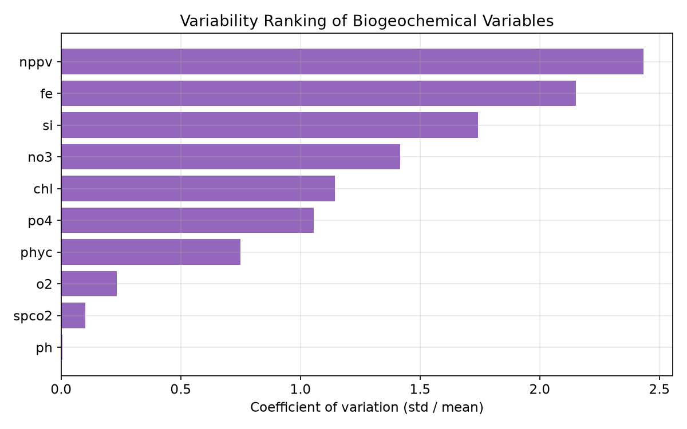
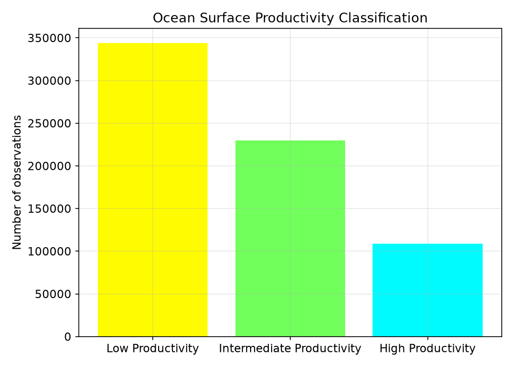
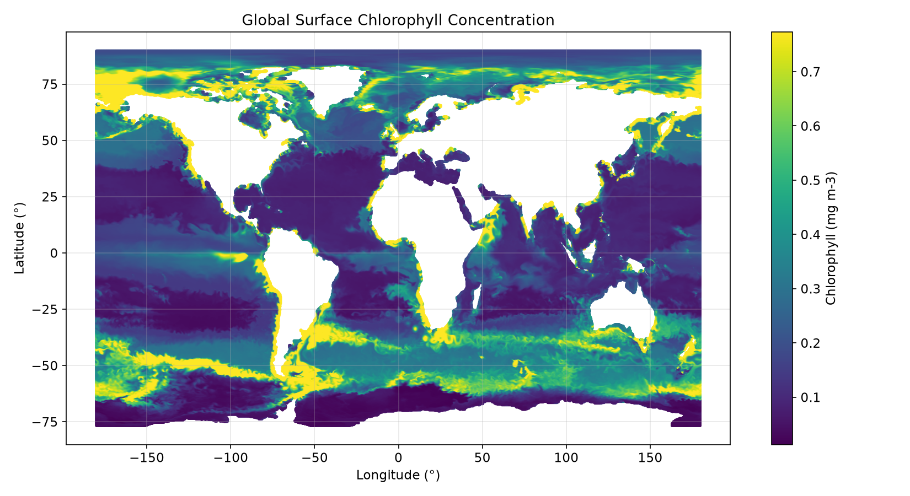
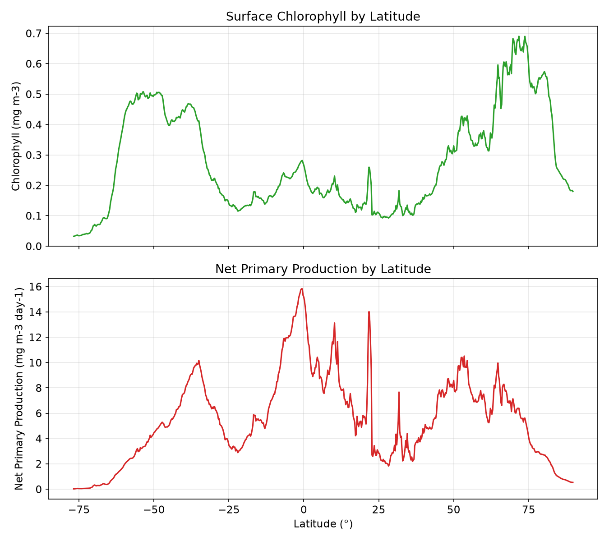
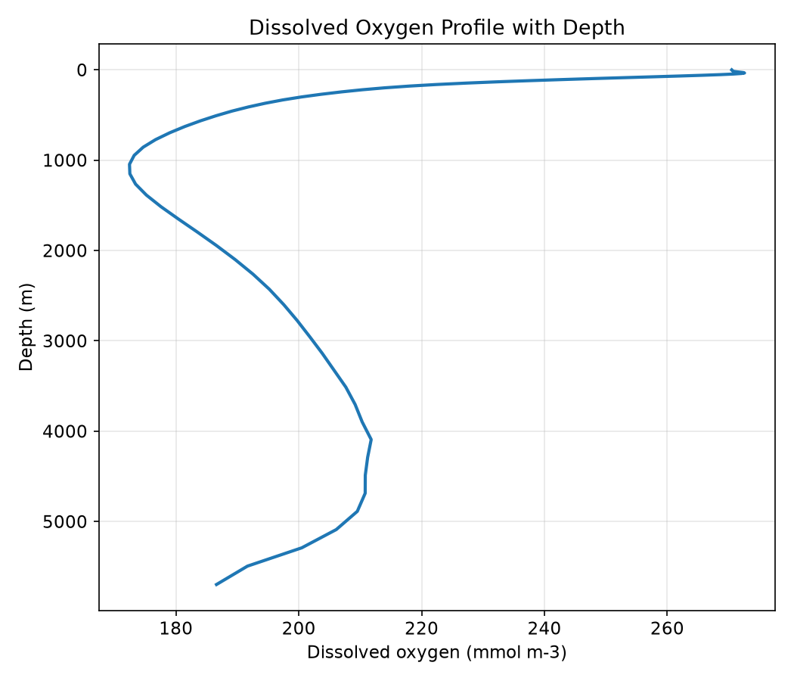

# <h1 align="center">**Global Ocean Biogeochemistry Analysis**</h1>

<p align="justify">Third project in my oceanographic data series. This time I went from a single-variable time series to a full 3D ocean model output: ten biogeochemical variables, 75 depth levels, global coverage. The goal was to build the whole pipeline myself — reading raw NetCDF files, masking out land, aggregating the data down to something usable, loading it into SQLite, and connecting it to Power BI.</p>

**Development environment:** Visual Studio Code (VS Code)

**Project status:** _Completed_ — Python, SQL and Power BI

## Why This Dataset
<p align="justify">My first project used a clean, already-tabular CSV. This one starts from raw model output, which meant dealing with grids, masks and multiple dimensions before I could even open the data in pandas. I picked the Global Ocean Biogeochemistry Hindcast because it's a real reanalysis product used in ocean/climate research, it covers a lot of ground (nutrients, oxygen, pH, chlorophyll, primary production) in one file, and it forced me to actually think about depth and coordinates instead of just a date column.</p>

Questions I tried to answer:
<table align="center">
  <tr>
    <th>Question</th>
    <th>Approach</th>
  </tr>
  <tr>
    <td>How is each variable distributed across the ocean surface?</td>
    <td>Global summary statistics per variable</td>
  </tr>
  <tr>
    <td>How does each variable change with latitude?</td>
    <td>Surface values averaged into latitude bands</td>
  </tr>
  <tr>
    <td>How does each variable change with longitude?</td>
    <td>Surface values averaged into longitude bands</td>
  </tr>
  <tr>
    <td>How does each variable behave from the surface down to the abyssal zone?</td>
    <td>Global vertical profile across all 75 depth levels</td>
  </tr>
  <tr>
    <td>Which variables are stable across the ocean, and which swing the most?</td>
    <td>Coefficient of variation per variable</td>
  </tr>
  <tr>
    <td>How productive is the ocean surface overall?</td>
    <td>Classification of grid cells into low/intermediate/high productivity</td>
  </tr>
  <tr>
    <td>Is the exported data actually valid (no impossible pH, no negative concentrations, etc.)?</td>
    <td>Quality control checks in SQL</td>
  </tr>
</table>

## Dataset
<p align="justify">
This is a numerical model product, not direct satellite or buoy measurements. It's produced at Mercator Ocean International using the PISCES biogeochemical model on the NEMO platform, forced by FREEGLORYS2V4 ocean physics and ERA-Interim atmosphere. There's no data assimilation, so it's a physically consistent simulation rather than an observation-corrected record.
</p>

[Source: Copernicus Marine Service — Global Ocean Biogeochemistry Hindcast (GLOBAL_MULTIYEAR_BGC_001_029)](https://data.marine.copernicus.eu/product/GLOBAL_MULTIYEAR_BGC_001_029/description)

<table align="center">
  <tr>
    <th>Property</th>
    <th>Value</th>
  </tr>
  <tr><td>Product ID</td><td><code>GLOBAL_MULTIYEAR_BGC_001_029</code></td></tr>
  <tr><td>Reference month used here</td><td>September 2025 (monthly mean)</td></tr>
  <tr><td>Full product coverage</td><td>January 1993 to present</td></tr>
  <tr><td>Spatial extent</td><td>Global ocean, lat -80° to 90°, lon -180° to 179.75°</td></tr>
  <tr><td>Native resolution</td><td>0.25° horizontal, 75 depth levels</td></tr>
  <tr><td>Format</td><td>NetCDF-4</td></tr>
</table>

<p align="justify">Three raw files go into this project: the monthly biogeochemical fields (the 10 variables, 3D), the grid coordinates, and the ocean/land mask.</p>

### Variables
<table align="center">
  <tr>
    <th>Code</th>
    <th>Name</th>
    <th>Unit</th>
  </tr>
  <tr><td><code>spco2</code></td><td>Surface CO₂</td><td>Pa</td></tr>
  <tr><td><code>chl</code></td><td>Total chlorophyll</td><td>mg m⁻³</td></tr>
  <tr><td><code>fe</code></td><td>Dissolved iron</td><td>mmol m⁻³</td></tr>
  <tr><td><code>no3</code></td><td>Nitrate</td><td>mmol m⁻³</td></tr>
  <tr><td><code>nppv</code></td><td>Primary production</td><td>mg m⁻³ day⁻¹</td></tr>
  <tr><td><code>o2</code></td><td>Dissolved oxygen</td><td>mmol m⁻³</td></tr>
  <tr><td><code>ph</code></td><td>pH</td><td>dimensionless</td></tr>
  <tr><td><code>phyc</code></td><td>Total phytoplankton</td><td>mmol m⁻³</td></tr>
  <tr><td><code>po4</code></td><td>Phosphate</td><td>mmol m⁻³</td></tr>
  <tr><td><code>si</code></td><td>Dissolved silicate</td><td>mmol m⁻³</td></tr>
</table>

## What I Did
<p align="justify">The pipeline is a sequence of numbered scripts, each doing one thing:</p>

<table align="center">
  <tr><th align="center">Step</th><th align="center">Script</th><th align="center">Purpose</th></tr>
  <tr><td align="center">01</td><td><code>inspect_netcdf.py</code></td><td align="justify">Look at the monthly NetCDF file — dimensions, variables, missing values</td></tr>
  <tr><td align="center">02</td><td><code>inspect_coordinates.py</code></td><td align="justify">Look at the grid coordinates file</td></tr>
  <tr><td align="center">03</td><td><code>inspect_mask.py</code></td><td align="justify">Look at the ocean/land mask</td></tr>
  <tr><td align="center">04</td><td><code>analyze_grid.py</code></td><td align="justify">Cross-check coordinates against the mask, check ocean vs. land coverage</td></tr>
  <tr><td align="center">05</td><td><code>prepare_data.py</code></td><td align="justify">Extract the surface level, apply the mask, export the CSV</td></tr>
  <tr><td align="center">06</td><td><code>create_aggregations.py</code></td><td align="justify">Global, latitude and longitude aggregations</td></tr>
  <tr><td align="center">07</td><td><code>prepare_depth_data.py</code></td><td align="justify">Global vertical profile per variable</td></tr>
  <tr><td align="center">08</td><td><code>create_dimensions.py</code></td><td align="justify">Build the dimension tables</td></tr>
  <tr><td align="center">09</td><td><code>create_database.py</code></td><td align="justify">Load everything into SQLite and index it</td></tr>
  <tr><td align="center">10</td><td><code>validate_database.py</code></td><td align="justify">Validate the finished database</td></tr>
  <tr><td align="center">12</td><td><code>generate_figures.py</code></td><td align="justify">Generate the PNG figures below from the database</td></tr>
</table>

**Masking**
<p align="justify">
Before exporting anything I applied the model's own ocean/land mask (<code>mask == 1</code>), so land cells and empty cells just don't show up in the tables — no nulls to clean up later, which is why the completeness check below is 100% across the board.
</p>

```python
# Apply the ocean mask to the surface level before exporting anything
ocean_mask = mask_ds["mask"].isel(depth=0)

surface = ds[variables].isel(depth=0)
surface = surface.where(ocean_mask == 1)

df_surface = surface.to_dataframe().reset_index()
df_surface = df_surface.dropna(subset=variables, how="all")
```

**Surface vs. depth**
<p align="justify">
The main table only keeps the surface level (~0.5 m) — that alone is already 682,424 rows, and a full 3D export (75 levels × the whole grid) would've been overkill for this project. The full water column still gets used, just aggregated into one global profile per variable instead of a full cube.
</p>

**Depth categories**
<p align="justify">
I grouped the 75 raw depth levels into six bands so it's easier to filter by depth in SQL/Power BI without thinking in meters:
</p>

<table align="center">
  <tr><th>Category</th><th>Depth range</th></tr>
  <tr><td>Surface</td><td>≤ 10 m</td></tr>
  <tr><td>Shallow</td><td>10–50 m</td></tr>
  <tr><td>Upper Ocean</td><td>50–200 m</td></tr>
  <tr><td>Intermediate</td><td>200–1,000 m</td></tr>
  <tr><td>Deep Ocean</td><td>1,000–4,000 m</td></tr>
  <tr><td>Abyssal</td><td>&gt; 4,000 m</td></tr>
</table>

```python
def classify_depth(depth):
    if depth <= 10:
        return "Surface"
    elif depth <= 50:
        return "Shallow"
    elif depth <= 200:
        return "Upper Ocean"
    elif depth <= 1000:
        return "Intermediate"
    elif depth <= 4000:
        return "Deep Ocean"
    return "Abyssal"

df_depth["depth_category"] = df_depth["depth_m"].apply(classify_depth)
```

**Database (star schema)**
<p align="justify">
<code>ocean_biogeochemistry.db</code> separates fact tables (the actual observations and stats) from dimension tables (<code>dim_variable</code>, <code>dim_depth</code>, <code>dim_date</code>), so Power BI can relate everything properly instead of repeating text columns in every table.
</p>

```python
df_surface.to_sql("surface_biogeochemistry", connection, if_exists="replace", index=False)
df_global.to_sql("global_surface_statistics", connection, if_exists="replace", index=False)
df_depth.to_sql("global_depth_profiles", connection, if_exists="replace", index=False)

cursor.execute("""
    CREATE INDEX IF NOT EXISTS idx_surface_latitude
    ON surface_biogeochemistry(latitude)
""")
```

**Quality control**
<p align="justify">
Checked for missing values, checked pH stays in [0, 14], checked no negative concentrations, checked coordinates are within range, and ran <code>PRAGMA integrity_check</code> on the final database.
</p>

```sql
-- pH values outside the valid chemical range (0-14)
SELECT COUNT(*) AS invalid_ph
FROM surface_biogeochemistry
WHERE ph IS NOT NULL
AND (ph < 0 OR ph > 14);

-- Negative concentrations that should not occur
SELECT COUNT(*) AS negative_oxygen_values
FROM surface_biogeochemistry
WHERE o2 < 0;
```

## Database Structure
<table align="center">
  <tr><th align="center">Table</th><th align="center">Rows</th><th align="center">What's in it</th></tr>
  <tr><td align="center"><code>surface_biogeochemistry</code></td><td align="center">682,424</td><td align="justify">Fact table — every ocean grid cell at the surface, September 2025</td></tr>
  <tr><td align="center"><code>global_surface_statistics</code></td><td align="center">10</td><td align="justify">Mean, median, std, min/max, quartiles per variable</td></tr>
  <tr><td align="center"><code>latitude_surface_statistics</code></td><td align="center">6,670</td><td align="justify">Mean value per variable per latitude band</td></tr>
  <tr><td align="center"><code>longitude_surface_statistics</code></td><td align="center">14,400</td><td align="justify">Mean value per variable per longitude band</td></tr>
  <tr><td align="center"><code>global_depth_profiles</code></td><td align="center">666</td><td align="justify">Global average per variable, per depth level</td></tr>
  <tr><td align="center"><code>dim_variable</code></td><td align="center">10</td><td align="justify">Variable code, name, unit</td></tr>
  <tr><td align="center"><code>dim_depth</code></td><td align="center">75</td><td align="justify">Depth in meters + depth category</td></tr>
  <tr><td align="center"><code>dim_date</code></td><td align="center">1</td><td align="justify">The one reference month</td></tr>
</table>

<p align="justify">Column-by-column definitions are in <a href="data_dictionary.md"><code>data_dictionary.md</code></a>.</p>

## Data Quality
<p align="justify">Zero missing values across all 10 variables — expected, since the mask already removed land/no-data cells before export. All validity checks passed and the database integrity check came back <code>ok</code>. Full report in <a href="data_quality.md"><code>data_quality.md</code></a>.</p>

<p align="center"><strong>Value ranges (surface, September 2025)</strong></p>

<table align="center">
  <tr><th>Variable</th><th>Min</th><th>Mean</th><th>Max</th></tr>
  <tr><td>spco2 (Pa)</td><td>6.21</td><td>40.69</td><td>440.47</td></tr>
  <tr><td>chl (mg m⁻³)</td><td>0.013</td><td>0.284</td><td>19.66</td></tr>
  <tr><td>fe (mmol m⁻³)</td><td>0.0000</td><td>0.0005</td><td>0.031</td></tr>
  <tr><td>no3 (mmol m⁻³)</td><td>0.0004</td><td>7.226</td><td>129.04</td></tr>
  <tr><td>nppv (mg m⁻³ day⁻¹)</td><td>0.0001</td><td>5.407</td><td>1,417.77</td></tr>
  <tr><td>o2 (mmol m⁻³)</td><td>148.02</td><td>270.50</td><td>423.74</td></tr>
  <tr><td>ph</td><td>5.89</td><td>8.02</td><td>8.53</td></tr>
  <tr><td>phyc (mmol m⁻³)</td><td>0.040</td><td>1.547</td><td>56.10</td></tr>
  <tr><td>po4 (mmol m⁻³)</td><td>0.0000</td><td>0.648</td><td>4.27</td></tr>
  <tr><td>si (mmol m⁻³)</td><td>0.242</td><td>14.653</td><td>503.87</td></tr>
</table>

<p align="justify"><code>nppv</code> and <code>si</code> have maximums way above their mean — makes sense since production and silicate concentrate in specific spots (upwelling zones, polar waters) rather than being spread evenly. <code>spco2</code> above ~440 Pa is worth double-checking against known upwelling regions before treating it as typical.</p>

**Geographic and temporal coverage:** latitude -76.75° to 89.75°, longitude -180.0° to 179.75°, single monthly mean for September 2025.

## Visualisations
**Variability across variables**
<p align="justify">
Coefficient of variation per variable — pH and spco2 barely move across the whole ocean surface, while nppv, fe, si and no3 swing a lot, which tracks with how patchy nutrient and productivity processes actually are in the real ocean.
</p>

```python
df_var = pd.read_sql_query("""
    SELECT variable, std / NULLIF(mean, 0) AS coefficient_variation
    FROM global_surface_statistics
    ORDER BY coefficient_variation DESC;
""", connection)

ax.barh(df_var["variable"], df_var["coefficient_variation"], color="#9467bd")
```

<p align="center">
  
</p>

**Surface productivity**
<p align="justify">
Classified every grid cell into low, intermediate or high productivity based on primary production. Most of the ocean surface falls into the low category — high-productivity water is the exception, not the rule.
</p>

<p align="center">
  
</p>

**Global chlorophyll**
<p align="justify">
Chlorophyll concentration mapped across the whole globe. The pattern is pretty recognizable if you know basic ocean circulation — high values along coastlines and in the Southern Ocean, low values in the open-ocean subtropical gyres.
</p>

<p align="center">
  
</p>

**Chlorophyll and primary production by latitude**
<p align="justify">
Both variables peak near the equator and again at high latitudes (especially the Southern Ocean around 60°S and the North Atlantic/Pacific around 60-75°N), and drop off in the subtropics around ±20-30°, which lines up with where nutrients are actually available near the surface.
</p>

<p align="center">
  
</p>

**Oxygen with depth**
<p align="justify">
Dissolved oxygen starts high at the surface, drops sharply to a minimum around 800-1,000 m (the oxygen minimum zone), then slowly climbs back up toward the deep ocean. This is a well-known feature of ocean circulation — the mid-depth minimum shows up because that's roughly where organic matter sinking from the surface gets consumed by bacteria, using up oxygen faster than deep circulation can replace it.
</p>

<p align="center">
  
</p>

## Power BI Dashboard
<p align="justify">
The processed tables were loaded into Power BI to turn the database into an interactive exploration of the September 2025 ocean biogeochemistry data. The dashboard uses the project's fact and dimension tables to connect global surface statistics, geographic distributions and depth profiles in one report.
</p>

<p align="justify">
The report is organised into multiple pages rather than putting every visual on a single dashboard. This makes it easier to move from a general overview of the ocean surface to more specific questions about geographic variability, vertical structure and biological productivity.
</p>

**Page 1 — Ocean Biogeochemistry Overview**
<p align="justify">
The first page gives a general snapshot of the global ocean surface for September 2025. KPI cards highlight the mean values of key variables including chlorophyll, dissolved oxygen, pH and primary production, while the geographic visualisation shows how surface biogeochemical values are distributed across the global ocean.
</p>

<p align="justify">
This page works as the entry point to the report: instead of starting with raw tables or individual variables, it gives a quick overview of the scale and structure of the dataset.
</p>

**Page 2 — Global Surface Variability**
<p align="justify">
The second page focuses on how the ten biogeochemical variables differ across the global ocean surface. Global summary statistics and the coefficient of variation are used to compare variables that remain relatively stable with variables that show much stronger spatial variation.
</p>

<p align="justify">
Because the variables have very different units and ranges, comparing raw values alone would not be particularly useful. The coefficient of variation provides a clearer way to identify which variables are more evenly distributed and which are concentrated in specific ocean regions.
</p>

**Page 3 — Ocean Depth Profile**
<p align="justify">
The depth page uses the global depth profile table to explore how biogeochemical conditions change through the water column. The original 75 depth levels are also grouped into broader depth categories — Surface, Shallow, Upper Ocean, Intermediate, Deep Ocean and Abyssal — making the vertical structure easier to explore interactively.
</p>

<p align="justify">
This part of the dashboard is particularly useful for variables such as dissolved oxygen, nutrients and phytoplankton-related indicators, where the surface alone does not tell the whole story. Instead of exporting the complete 3D model grid into Power BI, the project uses global averages by depth level to keep the report manageable while still preserving the vertical dimension of the ocean.
</p>

**Page 4 — Productivity and Biogeochemical Patterns**
<p align="justify">
The final page focuses on surface productivity and the relationship between biological activity and ocean biogeochemistry. Grid cells are classified into low, intermediate and high productivity categories based on primary production, allowing the report to show how productive regions are distributed across the dataset.
</p>

<p align="justify">
Together with chlorophyll and other surface indicators, this provides a more interpretable view of where biological activity is concentrated and where the ocean surface is comparatively less productive.
</p>

**Data Model**
<p align="justify">
The Power BI model follows the same general structure as the SQLite database. The main fact and statistics tables are connected to dimension tables containing variable metadata, depth information and the reference date. This avoids repeating descriptive information across the large observation tables and allows filters to work consistently throughout the report.
</p>

<p align="justify">
The dashboard therefore represents the final stage of the project pipeline: raw NetCDF model output -> Python processing and aggregation -> SQLite database -> Power BI visualisation.
</p>

```sql
-- Example query used to feed the Page 1 KPI cards
SELECT
    AVG(chl)  AS average_chlorophyll,
    AVG(nppv) AS average_primary_production,
    AVG(o2)   AS average_oxygen,
    AVG(ph)   AS average_ph
FROM surface_biogeochemistry;
```

<p align="justify">Power BI report file: <code>global_ocean_biogeochemistry_dashboard.pbix</code></p>

## Output Files
<table align="center">
  <tr><th align="center">File</th><th align="center">Description</th></tr>
  <tr><td align="center"><code>surface_biogeochemistry_2025_09.csv</code></td><td align="center">Masked surface-level observations, all grid cells</td></tr>
  <tr><td align="center"><code>global_surface_statistics.csv</code></td><td align="center">Global summary stats per variable</td></tr>
  <tr><td align="center"><code>latitude_surface_statistics.csv</code></td><td align="center">Mean per variable per latitude band</td></tr>
  <tr><td align="center"><code>longitude_surface_statistics.csv</code></td><td align="center">Mean per variable per longitude band</td></tr>
  <tr><td align="center"><code>global_depth_profiles.csv</code></td><td align="center">Global average per variable per depth level</td></tr>
  <tr><td align="center"><code>dim_variable.csv</code> / <code>dim_depth.csv</code> / <code>dim_date.csv</code></td><td align="center">Dimension tables</td></tr>
  <tr><td align="center"><code>ocean_biogeochemistry.db</code></td><td align="center">Final SQLite database loaded into Power BI</td></tr>
</table>

## Notes
<p align="justify">
It's worth spelling out why any of this matters beyond being a good pipeline exercise. Ocean biogeochemistry — the cycling of carbon, oxygen, nitrogen, phosphorus and other elements through seawater and marine life — is one of the main reasons the ocean has any influence on climate at all, and it's central to how marine ecosystems actually work.
</p>

<p align="justify">
<strong>Carbon and the biological pump.</strong> Roughly a quarter to a third of the CO₂ humans put into the atmosphere each year ends up absorbed by the ocean. Some of that happens through simple gas exchange at the surface, but a meaningful part moves through biology: phytoplankton fix CO₂ into organic matter, and when they die or get eaten, some of that carbon sinks toward the deep ocean and stays locked away for centuries — the biological carbon pump. Its efficiency depends directly on the variables in this dataset: nutrients (no3, po4, si, fe), phytoplankton biomass (phyc, chl) and productivity (nppv).
</p>

<p align="justify">
<strong>The oxygen minimum zone isn't just a curiosity.</strong> The mid-depth dip in dissolved oxygen shown in the profile above is a real, named feature of ocean chemistry — an oxygen minimum zone (OMZ) — and it's currently expanding. Warmer, more stratified surface water slows the ventilation that resupplies oxygen at depth, while more sinking organic matter consumes even more of it. The ocean has lost roughly 2% of its oxygen since 1960, and OMZs are projected to keep growing, shrinking habitable space for oxygen-dependent life and pushing chemistry toward processes that release additional greenhouse gases like nitrous oxide.
</p>

<p align="justify">
<strong>pH and ocean acidification.</strong> The CO₂ the ocean absorbs reacts with seawater and lowers its pH. Average surface pH has already dropped by roughly 0.1 units since pre-industrial times — about a 30% increase in acidity, since the scale is logarithmic — with further declines projected by 2100. This matters most for organisms that build shells or skeletons from calcium carbonate (corals, oysters, some plankton), since lower pH leaves less carbonate to build with and can even dissolve existing shells, with effects that ripple up several marine food webs.
</p>

<p align="justify">
<strong>Why the base of the food web matters practically.</strong> Primary production (nppv) and phytoplankton biomass (phyc, chl) are the entry point for essentially all energy in the ocean. The ecosystems built on that productivity support global fisheries that employ tens of millions of people and feed over three billion — so shifts in where and how much production happens connect directly to food security and coastal economies.
</p>

<p align="justify">
This dataset is essentially a snapshot of the ocean's chemistry and biology at a single point in time, but each variable maps onto one of these bigger, actively researched processes — which is part of why it felt more interesting to work with than a single time series.
</p>

<p align="justify">
That said, this project has real limits worth being upfront about. It's model output, not raw measurements — there's no data assimilation in this product, so it should be read as a physically consistent simulation rather than an observational record. Only one month (September 2025) was used, so there's no seasonality here, and the depth analysis is a single global average rather than a per-region profile — it can't show how the OMZ differs between, say, the Pacific and the Atlantic. That's a reasonable next step, just outside the scope of this version.
</p>

## Tools
**Programming and Development**
- Python
- SQL
- Power BI
- Visual Studio Code (VS Code)

**Python Libraries**
- Xarray
- Pandas
- NumPy
- Matplotlib

**Database**
- SQLite

**Data Format**
- NetCDF
- CSV

## Skills Demonstrated
<p align="center"><i>Python - Xarray - NetCDF Processing - Data Masking - SQL - Database Design - Star Schema - Data Quality Control - Statistical Analysis - Data Visualisation - Power BI - Scientific Data Analysis - Oceanographic Data</i></p>

## Bibliography
- [Copernicus Marine Service — Global Ocean Biogeochemistry Hindcast, product description](https://data.marine.copernicus.eu/product/GLOBAL_MULTIYEAR_BGC_001_029/description)
- [NOAA — Understanding Ocean Acidification](https://www.fisheries.noaa.gov/insight/understanding-ocean-acidification)
- [National Oceanography Centre — Marine Biogeochemistry](https://www.noc.ac.uk/our-work/climate/climate-impacts/marine-biogeochemistry)

## Author
### Mariana Gomes de Andrade Silva

<p align="center"><strong>Interests: Oceanography - Scientific Programming - Data Analysis - Environmental Data</strong></p>
